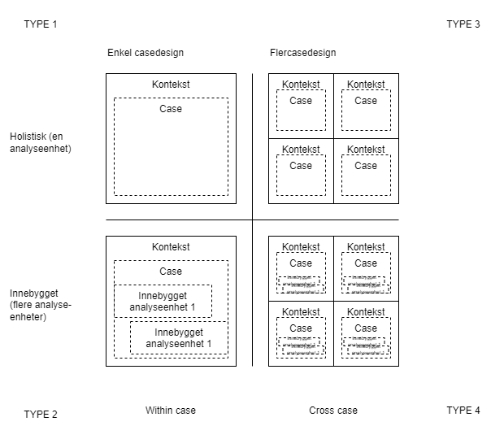
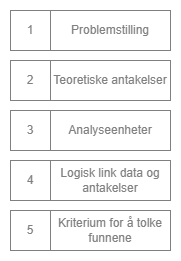

Yin (2018) arbeider med to dimensjoner i design av casestudier: enkelcase eller flere caser samt én eller flere analysenheter.

#### Fasene i casedesign
Yin (2014) mener at fem komponenter er spesielt viktige ved gjennomføring av caseundersøkelser: [[problemstilling]], teoretiske antakelser, [[analyseenhet]]er, logisk link mellom data og teoretiske antakelser og kriterier for å tolke funnene.

